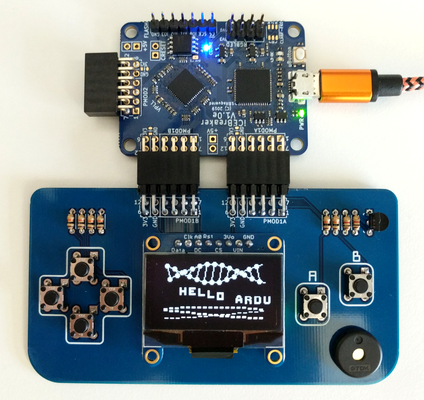

# Arduboy-KRZ

The [Arduboy](https://arduboy.com/) is a neat credit-card sized handhled game system. It  officially runs on the atmega32u4. As a part of the [Kronos RISC-V](https://github.com/SonalPinto/kronos) project, I've ported the [Arduboy2](https://github.com/MLXXXp/Arduboy2) library since it is the most popular framework for developing games for the Arduboy. The game system and games are **natively** compiled for RISC-V, rather than emulated.



Early protoype: https://www.youtube.com/watch?v=nveWIcuFHzo


# Press Start

*Status*::
- Currently, I'm porting games and dependant libs (ArduboyTones, FixedPoints, etc).
- You can build individual games and run 'em on the system (See Build section below).
- Save Game feature (right now, the EEPROM is emulated in RAM).
- Loader UI (pick a game from a library on flash) - todo

Assorted list of games ported, mostly from eried's [ArduboyCollection](https://github.com/eried/ArduboyCollection) and other popular titles that I found interesting in the [Arduboy Community Forums](https://community.arduboy.com).

|Game|Author|License|Source|
|---|---|---|---|
|ArduBreakout|MLXXXP|LGPL-2.1|[Github](https://github.com/MLXXXp/Arduboy2/tree/master/examples/ArduBreakout)|
|ChromeDino|flaki|Unspecified|[Github](https://github.com/flaki/arduboy-rund-ino.git)|


# Software

Porting the Arduboy2 library was a breeze because of how well documented the code is. The avr-asm specific code have neat equivlanet C++ in the comments surrounding them. Display and input hardware specific calls were easy to replace - SPI writes for the OLED and GPIO polls for the input. Audio and EEPROM (save files) were *slightly* tricky.

I had a lot of help from the [Arduboy community forums (https://community.arduboy.com/t/arduboy-clone-on-risc-v-fpga/8843),  especially from Pharap and MLXXXP. For example, being reminded that the avr-libc types are a thing -- where int is 16b. Aside from the original Arudoboy2 library, I used Pharap's [PokittoArduboy2Prototype](https://github.com/Pharap/PokittoArduboy2Prototype) as a reference for this work.

### Arduboy2

The arduboy2 library port is located under [src/arduboy2](src/arduboy2). Note how the library uses fixed width types (`uint8_t`, `int16_t`, etc) making porting onto different architecutes (say, riscv32) a trifle affair.
* The SpritesB class is aliased to the Sprites class, and the `drawBitmap` function from SpritesB is used.
* The Audio/Beep functions are yet to be implemented.
* All avr-asm is obviously replaced (thanks to the helpful code in the library comments).
* Arduino-specific operation and code is stripped out, like `mainNoUSB`, `exitToBootloader`, `setCPUSpeed8MHz`, etc.
* Removed all variants of bootLogo except for the default one.
* Removed flashlight and system controls. This is handled by the Loader.
* Random seed generated (`generateRandomSeed`) using values read from the hardware performance counters.
* Print functions included within Arduboy class with definitions in Arduboy2Print.cpp.


### EEPROM and Save Files

The 1KB EEPROM functionality is maintained in RAM, since there is no actual EEPROM. For now, this is entirely volatile. A feature to save this data onto the onboard Flash is yet to be implemented. Need to be smart about this, since writing to Flash is a costly operation.


### Build

The project rides on a cmake build flow. To build from source you'll need these:
  - [riscv-gnu-toolchain](https://github.com/riscv/riscv-gnu-toolchain)
  - [picolibc](https://github.com/keith-packard/picolibc)
  - [iceprog](https://github.com/cliffordwolf/icestorm.git)
  - [cmake](https://cmake.org/)

>Why picolibc?

>newlibc's crt0 only sets up the global pointer and initializes the bss. It expects the "host envioronment" to setup the critical stack pointer before entering the application, which on most embedded solutions is non existant. Hence, almost everyone rolls their own crt0.

>However, picolibc brings a breath of fresh air to the embedded libc world with a crt0 that actually _initializes_ the stack pointer. Hence, now all I need to do is setup the trap handler vector. Done.

>This is merely one of its attractive features. There's also the fine tuned minimalist stdlib with TLS, and tinystdio. I have no doubt that picolibc will replace newlibc-nano for embedded applications.

First, prepare the build directory and construct targets with cmake. Then, any title under the Demos and Games directory can be compiled. Lastly, the prepared binary can be flashed onto the icebreaker with iceprog. Note that the application is stored at a base address of 0x100000 as the lowest 1MB is preserved for the KRZ SoC FPGA image. This is the procedure for flashing individual games onto the Arduboy-KRZ.

```
mkdir build
cd build
cmake ..

make SiNe-DeMo

iceprog -o 1M bin/SiNe-DeMo.krz.bin
```

*Demos*
- blinky: Minimal
- oled: draw patterns on the OLED
- HelloWorld: Scrolling Text
- SiNe-DeMo: Team ARG's demo showing off compute capabilities of the system
- Buttons: Button test


# Hardware

This project runs on the KRZBOY SoC on the iCEBreaker FPGA board. The [Arduboy PMOD](https://github.com/SonalPinto/arduboy-pmod) designed along the minimalist spirit of the Arduboy hardware is a credit card sized dual PMOD (Peripheral Module) adaptor. The whole system (iCEBreaker + Arduboy-PMOD) is called the *Arduboy-KRZ*.

The KRZBOY SoC is a [minor variant](https://github.com/SonalPinto/kronos/blob/master/rtl/platform/krz/krzboy.sv) of the KRZ SoC. It is a Kronos-powered SoC designed for the iCE40UP5K.

  - 128KB of RAM as 2 contiguous banks of 64KB.
  - 1KB Bootrom for loading program from flash to RAM.
  - UART TX with 128B buffer.
    - Configurable baud rate
  - SPI Master with 256B RX/TX buffers.
    - Configurable SPI Mode and rate.
    - Max 12MHz.
  - 12 Bidirectional configurable GPIO.
    - Debounced inputs.
  - General Purpose registers
  - Tiny PWM for Speaker -- *WIP*

On the iCEBreaker, this is the pinout:

|    PIN    | iCEBreaker |               Use               | Location |
|-----------|------------|---------------------------------|----------|
| TX        |          9 | UART TX on FTDI Channel-2       | board    |
| SCLK      |         15 | SPI FLASH clock                 | board    |
| MOSI      |         14 | SPI FLASH data in               | board    |
| MISO      |         17 | SPI FLASH data out              | board    |
| OLED_CLK  |         43 | Duplicate SCLK - OLED SPI clock | PMOD1B   |
| OLED_DATA |         38 | Duplicate MOSI - OLED SPI data  | PMOD1B   |
| GPIO0     |         11 | LEDR                            | board    |
| GPIO1     |         37 | LEDG                            | board    |
| GPIO2     |         16 | SPI FLASH chip select           | board    |
| GPIO3     |         34 | OLED chip select                | PMOD1B   |
| GPIO4     |         31 | OLED command/data select (DC)   | PMOD1B   |
| GPIO5     |         42 | OLED reset (RST)                | PMOD1B   |
| GPIO6     |          4 | Button-Left                     | PMOD1A   |
| GPIO7     |          2 | Button-Right                    | PMOD1A   |
| GPIO8     |         47 | Button-Up                       | PMOD1A   |
| GPIO9     |         45 | Button-Down                     | PMOD1A   |
| GPIO10    |          3 | Button-A                        | PMOD1A   |
| GPIO11    |         48 | Button-B                        | PMOD1A   |
| SPK       |         46 | Speaker(PWM)                    | PMOD1A   |


With trivial effort, both the gateware and firmware can be ported to other FPGA platforms, while using the same gamepad PCB PMOD --- as long as they have PMOD connectors, else the PCB will need minor rework.

I will probably make an Adafruit Feather connector version of this gamepad when I get my [OrangeCrab](https://github.com/gregdavill/OrangeCrab). Of course, with a new SoC that harnesses the power of the OrangeCrab. And, take advantage of the BMS on the OC to go full handheld.


# License

Licensed under Apache License, Version 2.0 (see [LICENSE](LICENSE) for full text). Except for portions explicitly noted.

The original Arduboy2 library ([link](https://github.com/MLXXXp/Arduboy2)) is licensed under BSD 3-Clause ([link](https://opensource.org/licenses/BSD-3-Clause)).

The games and libraries have their licenses in their individual directories.
